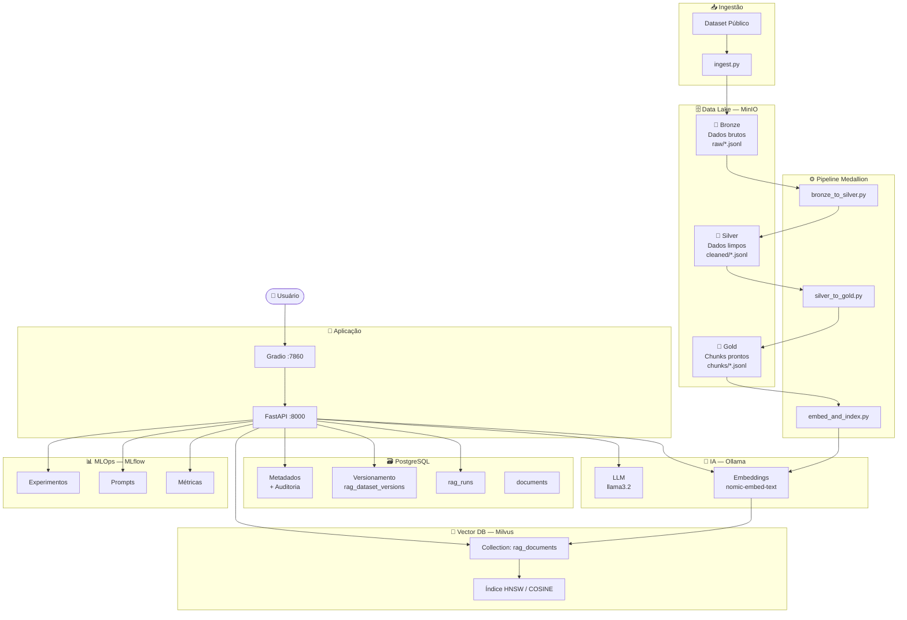

```mermaid
graph TB
    subgraph INGESTAO["📥 Ingestão"]
        DS[Dataset Público]
        INGEST[ingest.py]
    end

    subgraph DATALAKE["🗄️ Data Lake — MinIO"]
        BRONZE["🥉 Bronze\nDados brutos\nraw/*.jsonl"]
        SILVER["🥈 Silver\nDados limpos\ncleaned/*.jsonl"]
        GOLD["🥇 Gold\nChunks prontos\nchunks/*.jsonl"]
    end

    subgraph PIPELINE["⚙️ Pipeline Medallion"]
        B2S[bronze_to_silver.py]
        S2G[silver_to_gold.py]
        EMBED[embed_and_index.py]
    end

    subgraph VETORIAL["🔢 Vector DB — Milvus"]
        COL[Collection: rag_documents]
        HNSW[Índice HNSW / COSINE]
    end

    subgraph RELACIONAL["🗃️ PostgreSQL"]
        META[Metadados\n+ Auditoria]
        VER[Versionamento\nrag_dataset_versions]
        RUNS[rag_runs]
        DOCS[documents]
    end

    subgraph IA["🤖 IA — Ollama"]
        LLM["LLM\nllama3.2"]
        EMBM["Embeddings\nnomic-embed-text"]
    end

    subgraph MLOPS["📊 MLOps — MLflow"]
        EXP[Experimentos]
        PROMPTS[Prompts]
        METRICAS[Métricas]
    end

    subgraph APP["🚀 Aplicação"]
        API[FastAPI :8000]
        UI[Gradio :7860]
    end

    USUARIO([👤 Usuário])

    DS --> INGEST --> BRONZE
    BRONZE --> B2S --> SILVER
    SILVER --> S2G --> GOLD
    GOLD --> EMBED
    EMBED --> EMBM --> COL
    COL --> HNSW

    USUARIO --> UI --> API
    API --> EMBM
    API --> COL
    API --> LLM
    API --> META
    API --> VER
    API --> RUNS
    API --> EXP
    API --> PROMPTS
    API --> METRICAS
```
